# Platekit

[](LICENSE)
[](https://kotlinlang.org)
[](https://developer.android.com)
[](https://developer.android.com)

A configurable, reusable Android vehicle plate-number input: country picker, category/letter
rules, live visual preview, and validation — built so a default country and a set of
"other country" options are configuration, not hardcoded logic.

Originally extracted from a Qatar-based fleet app's Customer Identification screen, where
the plate-country picker had grown into ~40% of one fragment's code. Splitting it into a
library made that logic testable on its own, and reusable in any project that needs a
similar "which country's plate is this" input — GCC-region apps in particular, but the
core is not GCC-specific.

## Supported Plates

The library provides high-fidelity, dimension-accurate renderings for vehicle plates across the GCC region.



### 🇰🇼 Kuwait Styles (Full Collection)
- **Standard & Long:** Standard (33x15), European Long (52x11), and Small formats.
- **Transport & Public:** Public (90), Public Transport (91), Buses (92), Taxis (93), Goods Exportation (95).
- **Security & Specialty:** Police, National Guard, Firefighting, Army, Construction, Export.
- **Diplomatic & Emiri:** Emiri Bureau, Emiri Guard, Diplomatic (with unique red band).
- **Motorcycles:** Square formats for both Private and Police bikes.

### 🇶🇦 Qatar Styles
- **Comprehensive:** Private, Taxi, Police, ISF, Diplomatic, Government.
- **Dynamic Rendering:** National maroon strip with serrated edge and sub-style specific badges.

### 🇸🇦 Saudi Arabia, 🇧🇭 Bahrain, 🇴🇲 Oman, 🇦🇪 UAE
- **Saudi Arabia:** Accurate Palm & Crossed Swords with bilingual 2x2 grid.
- **Bahrain:** High-detail serrated national flag.
- **Oman:** Wide format with national seal.
- **UAE:** Region-specific emirate layouts (Dubai, Abu Dhabi, and more).

## Features

- **Configurable, not hardcoded.** Default country, enabled "other countries," and excluded
  countries are all set via a builder — no fragment/activity code branches on country.
- **Country-agnostic core.** `PlateCountryDefinition` is an open data class, not a closed
  enum, so any country's plate rules can be added without touching library internals.
- **Zero host-resource coupling.** `platekit-android` ships its own colors/drawables/strings;
  it never reaches into a consuming app's resources, so it drops into any project as-is.
- **Live visual preview.** Country-specific plate templates (including Qatar's
  taxi/police/diplomatic/government sub-styles) render as the user types.
- **Dynamic UI hooks.** Use `setOnCountryChangeListener` to adapt your host app's UI (like
  showing/hiding extra vehicle-type options) as the user switches between countries.
- **Fully unit-tested logic.** `platekit-core` has no Android dependency, so the
  build/validate rules are tested as plain JVM code, no emulator required.

## Modules

- **`platekit-core`** — pure Kotlin/JVM, zero Android dependency. Country definitions,
  category rules (single dropdown / two letters / three letters / none), the catalog/builder
  that describes one deployment's configuration, the plate-number builder + validator, and
  the visual-template resolver. Fully unit tested.
- **`platekit-android`** — the `PlateInputView` widget (country/category pickers, live
  preview, plate-number field) plus the supporting `VehiclePlateTemplateView`/
  `GccPlatePreviewView` rendering views. Ships its own colors/drawables/strings so it never
  depends on a host app's resources.
- **`sample`** — a minimal standalone demo Activity (Qatar default).
- **`dummy-sample`** — a second demo app showing how to default to Kuwait and handle dynamic
  UI changes (`com.example.platesample.dummy`).

## Quick start

```kotlin
binding.plateInputView.configure(
    PlateCountryCatalog.builder()
        .defaultCountry(PlateCountries.QATAR)          // primary/simple mode
        .enableCountries(*PlateCountries.gcc.toTypedArray())   // "other country" picker
        .excludeCountries(PlateCountries.JORDAN, PlateCountries.EGYPT) // optional: exclude multiple
        .unlistedCountryPolicy(UnlistedCountryPolicy.GENERIC_FALLBACK)
        .build()
)

binding.searchButton.setOnClickListener {
    when (val result = binding.plateInputView.getFormattedPlateNumber()) {
        is PlateInputResult.Valid -> submit(result.plateNumber)
        is PlateInputResult.Invalid -> showError(result.message)
    }
}
```

Switching the default country for a different deployment (e.g. Qatar → Kuwait) is a
one-line change to `defaultCountry(...)` — no code elsewhere needs to change.

## Built-in countries

Bahrain, Saudi Arabia, Kuwait, UAE, Qatar, Oman, Egypt, Jordan (`PlateCountries.gcc`).
`PlateCountryDefinition` is an open data class, not a closed enum — add your own for any
country not covered here.

## Build Requirements

- **JDK 1.8+** (Configured with `jvmTarget = "1.8"` for maximum compatibility across environments).
- **Android SDK 34** (Compile SDK).

## Status

Early extraction, not yet published to Maven/JitPack. Package name (`com.developer.platekit`)
and API are still subject to change before a 1.0 release.

## Contributing

Issues and pull requests are welcome — especially new `PlateCountryDefinition`s for
countries outside the current GCC set. No formal process yet; open an issue to discuss
anything non-trivial before sending a PR.

## License

Apache License 2.0 — see [LICENSE](LICENSE).
